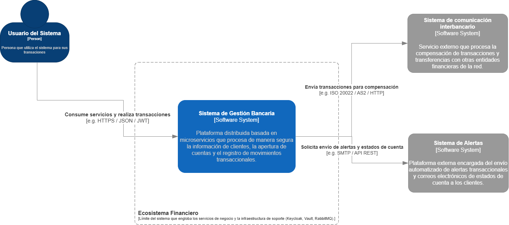
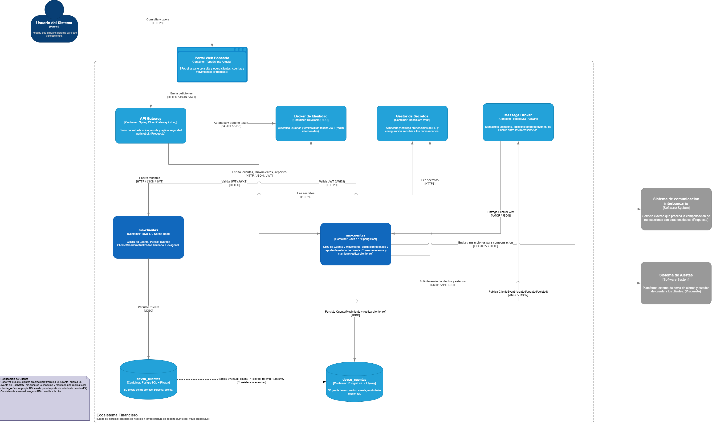
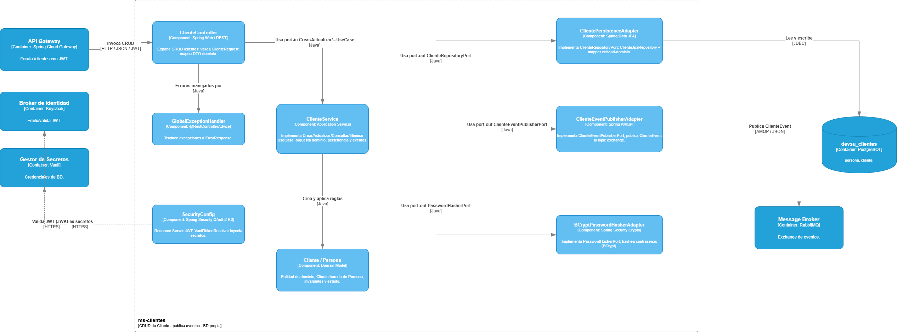
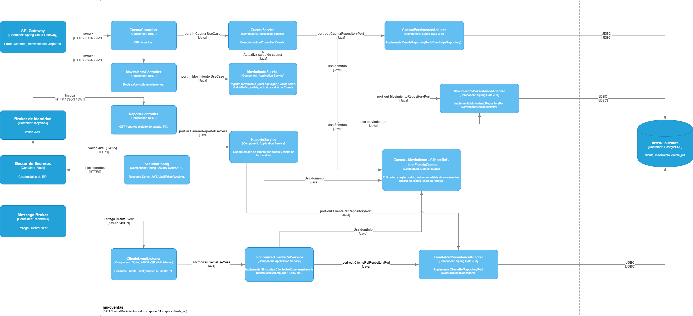

# Diagramas de Arquitectura — Modelo C4

Esta carpeta documenta la arquitectura del **Sistema de Gestión Bancaria**
(prueba técnica Devsu) usando el **[modelo C4](https://c4model.com/)**: una forma
de describir la arquitectura por **niveles de zoom**, de lo más general (contexto)
a lo más detallado (componentes).

| Archivo | Rol |
|---------|-----|
| [`PruebaDevsu.drawio`](PruebaDevsu.drawio) | **Fuente editable** — un solo archivo con una pestaña por nivel |
| `*.drawio.png` | **Exportaciones** de cada pestaña (lo que se ve aquí abajo) |

> Para editar: abre `PruebaDevsu.drawio` en [draw.io](https://app.diagrams.net/)
> y navega entre pestañas. Tras cambiar algo, re-exporta el PNG del nivel.

---

## 🎯 Alcance: diseño productivo vs. implementado

Estos diagramas describen la **arquitectura productiva**: cómo correría el sistema
en un **banco real en producción**, no solo lo construido para la prueba. Se
modela así a propósito, para mostrar que la solución está **pensada para
producción** y dónde encaja en un ecosistema bancario completo.

| Elemento del diagrama | Estado |
|-----------------------|--------|
| **ms-clientes**, **ms-cuentas** | ✅ Implementado (assessment) |
| **PostgreSQL** (×2), **RabbitMQ**, **Keycloak**, **Vault** | ✅ Implementado (infra real, ver [`../../infra/`](../../infra/)) |
| **Portal Web Bancario**, **API Gateway** | 🔭 Visión productiva (no implementado) |
| **Sistema interbancario**, **Sistema de Alertas** | 🔭 Sistemas externos (contexto productivo) |

> 🟦 azul = lo construido · ⬜ gris / 🔭 = visión productiva (contexto). Así el
> evaluador ve **qué se entregó** y **cómo escala** a un entorno real.

---

## Nivel 1 — Contexto del sistema

*¿Quién usa el sistema y con qué sistemas externos se relaciona?*



El **Sistema de Gestión Bancaria** es una plataforma distribuida (microservicios)
que procesa clientes, cuentas y movimientos. Su entorno:

| Elemento | Tipo | Relación |
|----------|------|----------|
| **Usuario del Sistema** | Persona | Consume servicios y realiza transacciones (`HTTPS / JSON / JWT`) |
| **Sistema de comunicación interbancario** | Sistema externo | Recibe transacciones para compensación (`ISO 20022 / AS2`) |
| **Sistema de Alertas** | Sistema externo | Envía alertas y estados de cuenta (`SMTP / API REST`) |
| **Ecosistema Financiero** | Límite | Engloba el negocio + la infra de soporte (Keycloak, Vault, RabbitMQ) |

> 🟦 El recuadro azul es **lo que construimos**. Los sistemas grises (interbancario,
> alertas) y el Portal son **contexto arquitectónico** (no parte del alcance del
> assessment, pero muestran dónde encaja la solución en un banco real).

---

## Nivel 2 — Contenedores

*¿De qué piezas desplegables se compone el sistema y cómo se comunican?*



| Contenedor | Tecnología | Rol |
|------------|------------|-----|
| **Portal Web Bancario** | SPA | Cliente web del usuario *(contexto)* |
| **API Gateway** | Spring Cloud Gateway | Punto de entrada, enruta con JWT *(contexto)* |
| **ms-clientes** | Java 17 / Spring Boot | CRUD de Cliente · **publica** eventos · BD propia |
| **ms-cuentas** | Java 17 / Spring Boot | CRU de Cuenta/Movimiento · reporte F4 · **consume** eventos |
| **devsu_clientes** | PostgreSQL | BD de ms-clientes |
| **devsu_cuentas** | PostgreSQL | BD de ms-cuentas |
| **Broker de Identidad** | Keycloak | Emite y valida JWT (OIDC/OAuth2) |
| **Gestor de Secretos** | Vault | Credenciales de BD fuera del código |
| **Message Broker** | RabbitMQ | Eventos asíncronos entre microservicios |

**Lo clave de este nivel** (el corazón de la prueba):
- **Database-per-service**: cada micro tiene su **propia** BD; nadie cruza a la del otro.
- **Comunicación asíncrona**: ms-clientes publica `ClienteEvent` → RabbitMQ →
  ms-cuentas mantiene una **réplica eventual** (`cliente_ref`) que usa el reporte.

> 📘 La defensa de estas decisiones está en
> [`../../best-practices/05-database-per-service-consistencia.md`](../../best-practices/05-database-per-service-consistencia.md).

---

## Nivel 3 — Componentes: ms-clientes

*¿Cómo está organizado por dentro ms-clientes? (Arquitectura Hexagonal)*



Se ven las **3 capas** de la arquitectura hexagonal y el flujo de dependencias
**hacia el dominio**:

| Componente | Capa | Responsabilidad |
|------------|------|-----------------|
| **ClienteController** | Adaptador IN (web) | Expone el CRUD REST, valida, mapea DTO↔dominio |
| **GlobalExceptionHandler** | Adaptador IN (web) | Traduce excepciones a `ErrorResponse` |
| **ClienteService** | Aplicación | Implementa los casos de uso; orquesta dominio, persistencia y eventos |
| **Cliente / Persona** | Dominio | Entidad pura (Cliente hereda de Persona) |
| **ClientePersistenceAdapter** | Adaptador OUT | Implementa `ClienteRepositoryPort` (Spring Data JPA) |
| **ClienteEventPublisherAdapter** | Adaptador OUT | Implementa `ClienteEventPublisherPort`, publica al exchange (AMQP) |
| **BCryptPasswordHasherAdapter** | Adaptador OUT | Implementa `PasswordHasherPort` (hash BCrypt) |
| **SecurityConfig** | Infra | Resource Server OAuth2; valida JWT (Keycloak) y lee secretos (Vault) |

> Nota cómo **todo apunta al centro**: los adaptadores dependen de **puertos**
> (interfaces), no al revés → **DIP** de SOLID.

---

## Nivel 3 — Componentes: ms-cuentas

*¿Cómo está organizado por dentro ms-cuentas? (Hexagonal + el consumidor de eventos)*



Misma arquitectura hexagonal, con tres controllers y la pieza **asíncrona**:

| Componente | Capa | Responsabilidad |
|------------|------|-----------------|
| **CuentaController / MovimientoController / ReporteController** | Adaptador IN | CRU de Cuenta (F1), Movimientos (F2/F3), Reporte (F4) |
| **CuentaService / MovimientoService / ReporteService** | Aplicación | Reglas de negocio: saldos, "Saldo no disponible", estado de cuenta |
| **Cuenta / Movimiento / ClienteRef** | Dominio | Entidades puras; el movimiento es un **ledger inmutable** |
| **\*PersistenceAdapter** | Adaptador OUT | Implementan los `RepositoryPort` (JPA) → `devsu_cuentas` |
| **ClienteEventListener** | Adaptador IN (async) | **Consume** `ClienteEvent` desde RabbitMQ |
| **SincronizarClienteRefService** | Aplicación | Actualiza la réplica `cliente_ref` (idempotente) |
| **SecurityConfig** | Infra | Resource Server OAuth2 (Keycloak / Vault) |

> El **`ClienteEventListener` + `SincronizarClienteRefService`** son la otra mitad
> de la comunicación asíncrona: lo que ms-clientes publica, ms-cuentas lo consume
> y proyecta en su read-model (`cliente_ref`) para el reporte F4.

---

## Cómo se relacionan los niveles

```
Nivel 1 (Contexto)      →  el sistema como una caja + actores externos
   └─ Nivel 2 (Contenedores)  →  abre la caja: micros + BDs + infra
        └─ Nivel 3 (Componentes)  →  abre cada micro: capas hexagonales
```

Cada nivel es un **zoom** del anterior. El **Nivel 4 (Código)** se omite a
propósito: a ese detalle, el **código fuente** es la mejor documentación.

> 🔗 Volver al [README principal](../../README.md) ·
> Decisiones de diseño en [`best-practices/`](../../best-practices/).
